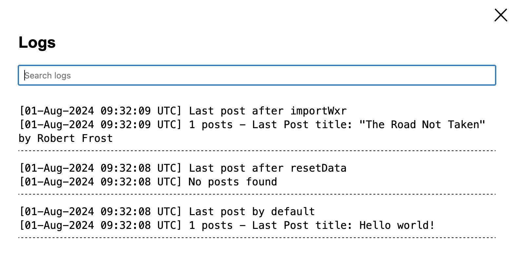

# Troubleshoot and debug Blueprints

When you build Blueprints, you might run into issues. Here are tips and tools to help you debug them:

## Review Common gotchas

-   Require `wp-load`: to run a WordPress PHP function using the `runPHP` step, you’d need to require [wp-load.php](https://github.com/WordPress/WordPress/blob/master/wp-load.php). So, the value of the `code` key should start with `"<?php require_once('wordpress/wp-load.php'); REST_OF_YOUR_CODE"`.
-   Enable `networking`: to access wp.org assets (themes, plugins, blocks, or patterns), or load a stylesheet using [add_editor_style()](https://developer.wordpress.org/reference/functions/add_editor_style/) (say, when [creating a custom block style](https://developer.wordpress.org/news/2023/02/creating-custom-block-styles-in-wordpress-themes)), you’d need to enable the `networking` option: `"features": {"networking": true}`.

## Blueprints Builder

You can use an in-browser [Blueprints editor](https://playground.wordpress.net/builder/builder.html) to build, validate, and preview your Blueprints in the browser.

:::danger Caution

The editor is under development and the embedded Playground sometimes fails to load. To get around it, refresh the page. We're aware of that, and are working to improve the experience.

:::

## Check for the Filesystem and Database

Some blueprint steps (such as [`writeFile`](/blueprints/steps#WriteFileStep)) alter the internal Filesystem structure of the Playground instance and some others (such as [`runSql`](/blueprints/steps#runSql)) alter the internal WordPress database.

To check the final internal filesytem structure and database (after the blueprint steps have been applied) we can leverage some WordPress plugins that provide a SQL manager and a file explorer such as [`SQL Buddy`](https://wordpress.org/plugins/sql-buddy/) and [`WPide`](https://wordpress.org/plugins/wpide/) (you can see them in action from https://playground.wordpress.net/?plugin=sql-buddy&plugin=wpide)

:::tip

There are a bunch of methods we can launch from the console of any WordPress Playground instance to inspect the internals of that instance. They're exposed as part of `window.playground` object (see [Developers > JavaScript API > Debugging and testing](/developers/apis/javascript-api/#debugging-and-testing)). Some examples:

```
> await playground.isDir("/wordpress/wp-content/plugins")
true
> await playground.listFiles("/wordpress/wp-content/plugins")
(3) ['hello.php', 'index.php', 'WordPress-Importer-master']
```

Full list of methods we can use is available [here](/api/client/interface/PlaygroundClient)

:::

## Check for errors in the browser console

If your Blueprint isn’t running as expected, open the browser developer tools to see if there are any errors.

To open the developer tools in Chrome, Firefox, Safari\*, and Edge: press `Ctrl + Shift + I` on Windows/Linux or `Cmd + Option + I` on macOS.

:::caution

If you haven't yet, enable the Develop menu: go to **Safari > Settings... > Advanced** and check **Show features for web developers**.

:::

The developer tools window allows you to inspect network requests, view console logs, debug JavaScript, and examine the DOM and CSS styles applied to your webpage. This is crucial for diagnosing and fixing issues with Blueprints.

## Log your own error messages

You can `error_log` your own error messages through [`runPHP` step](./steps#RunPHPStep) (see [blueprint example](https://github.com/wordpress/blueprints/blob/trunk/blueprints/reset-data-and-import-content/blueprint.json) and [live demo](https://playground.wordpress.net/?blueprint-url=https://raw.githubusercontent.com/wordpress/blueprints/trunk/blueprints/reset-data-and-import-content/blueprint.json)) and check them from the ["View Logs" option](../main/web-instance.md#playground-options-menu) or from the browser's console.



:::info
When you download your Playground instance as a `zip` through the ["Download as zip" option](../main/web-instance.md#playground-options-menu) you'll also download the `debug.log` file containing all the logs from your Playground instance.
:::

## Ask for help

The community is here to help! If you have questions or comments, [open a new issue](https://github.com/adamziel/blueprints/issues) in this repository. Remember to include the following details:

-   The Blueprint you’re trying to run.
-   The error message you’re seeing, if any.
-   The full output from the browser developer tools.
-   Any other relevant information that might help us understand the issue: OS, browser version, etc.
